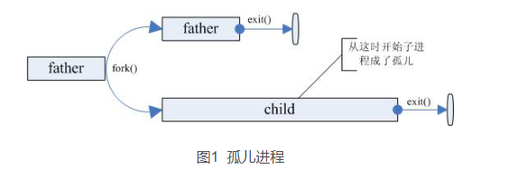
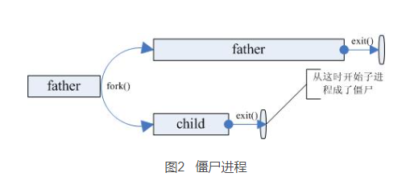
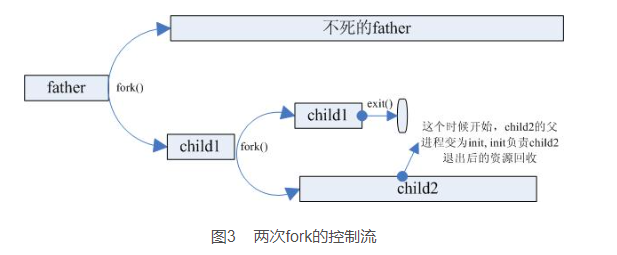

<style>
.wrap {
    max-width: 900px;
}
p {
    font-family: sans-serif;
    font-size: 15px;
    font-weight: 300;
    overflow-wrap: break-word; /* allow wrapping of very very long strings, like txids */
}
.post pre,
.post code {
    background-color: #fafafa;
    font-size: 13px; /* make code smaller for this post... */
}
pre {
 white-space: pre-wrap;       /* css-3 */
 white-space: -moz-pre-wrap;  /* Mozilla, since 1999 */
 white-space: -pre-wrap;      /* Opera 4-6 */
 white-space: -o-pre-wrap;    /* Opera 7 */
 word-wrap: break-word;       /* Internet Explorer 5.5+ */
}
</style>

## fork作用

从《Unix系统编程手册》这本书中，fork的作用是创建子进程，这两个进程**将执行相同的程文本段**，但却各自拥有**不同的栈段、数据段以及堆段拷贝**。子进程的栈、数据以及栈段开始时是对父进程内存相应各部分的完全复制。执行 fork()之后，每个进程均可修改各自的栈数据、以及堆段中的变量，而并不影响另一进程 

 书中给出了一个简单的例子

```C++
/*************************************************************************\
*                  Copyright (C) Michael Kerrisk, 2022.                   *
*                                                                         *
* This program is free software. You may use, modify, and redistribute it *
* under the terms of the GNU General Public License as published by the   *
* Free Software Foundation, either version 3 or (at your option) any      *
* later version. This program is distributed without any warranty.  See   *
* the file COPYING.gpl-v3 for details.                                    *
\*************************************************************************/

/* Listing 24-1 */

#include "tlpi_hdr.h"

static int idata = 111;             /* Allocated in data segment */

int
main(int argc, char *argv[])
{
    int istack = 222;               /* Allocated in stack segment */
    pid_t childPid;

    switch (childPid = fork()) {
    case -1:
        errExit("fork");

    case 0:
        idata *= 3;
        istack *= 3;
        break;

    default:
        sleep(3);                   /* Give child a chance to execute */
        break;
    }

    /* Both parent and child come here */

    printf("PID=%ld %s idata=%d istack=%d\n", (long) getpid(),
            (childPid == 0) ? "(child) " : "(parent)", idata, istack);

    exit(EXIT_SUCCESS);
}
```

输出结果如下：

```C++
PID=14944 (child)  idata=333 istack=666
PID=14943 (parent) idata=111 istack=222
```

## wait

系统调用 wait （&status） 的目的有二： 其一， 如果子进程尚未调用 exit()终止， 那么 wait()会挂起父进程直至子进程终止；其二，子进程的终止状态通过 wait()的 status 参数返回 ，下面是linux手册里面的wait的例子

```C++
#include <sys/wait.h>
#include <stdlib.h>
#include <unistd.h>
#include <stdio.h>
int
main(int argc, char *argv[])
{
    pid_t cpid, w;
    int wstatus;
    cpid = fork();
    if (cpid == -1) {
        perror("fork");
        exit(EXIT_FAILURE);
    }
    if (cpid == 0) {            /* Code executed by child */
        printf("Child PID is %ld\n", (long) getpid());
        if (argc == 1)
            pause();                    /* Wait for signals */
        _exit(atoi(argv[1]));
    } else {                    /* Code executed by parent */
        do {
            w = waitpid(cpid, &wstatus, WUNTRACED | WCONTINUED);
            if (w == -1) {
                perror("waitpid");
                exit(EXIT_FAILURE);
            }
            if (WIFEXITED(wstatus)) {
                printf("exited, status=%d\n", WEXITSTATUS(wstatus));
            } else if (WIFSIGNALED(wstatus)) {
                printf("killed by signal %d\n", WTERMSIG(wstatus));
            } else if (WIFSTOPPED(wstatus)) {
                printf("stopped by signal %d\n", WSTOPSIG(wstatus));
            } else if (WIFCONTINUED(wstatus)) {
                printf("continued\n");
            }
        } while (!WIFEXITED(wstatus) && !WIFSIGNALED(wstatus));
        exit(EXIT_SUCCESS);
    }
}
```

## execve

系统调用 execve(pathname， argv， envp)加载一个新程序（路径名为 pathname，参数列表为 argv， 环境变量列表为 envp） 到当前进程的内存。 这将丢弃现存的程序文本段，并为新程序重新创建栈、数据段以及堆。通常将这一动作称为执行（ execing）一个新程序。稍后会介绍构建于 execve()之上的多个库函数，每种都为编程接口提供了实用的变体。在彼此差异无关宏旨的场合，循例会将此类函数统称为 exec()，尽管实际上并没有以之命名的系统调用或者库函数  


## waitpid

The  following program demonstrates the use of fork(2) and waitpid().  The program  creates a child process.  If no command-line argument is supplied to the  program, then  the  child  suspends its execution using pause(2), to allow the user to send signals to the child.  Otherwise, if a command-line argument is supplied, then the child  exits  immediately,  using  the integer supplied on the command line as the exit status.  The parent process executes a loop that  monitors  the  child  using waitpid(),  and  uses  the  W*() macros described above to analyze the wait status value. The following shell session demonstrates the use of the program:
```C++
$ ./a.out &
Child PID is 32360
[1] 32359
$ kill -STOP 32360
stopped by signal 19
$ kill -CONT 32360
continued
$ kill -TERM 32360
killed by signal 15
[1]+  Done                    ./a.out
```
代码如下:
```C++
#include <sys/wait.h>
#include <stdlib.h>
#include <unistd.h>
#include <stdio.h>
int main(int argc, char *argv[])
{
    pid_t cpid, w;
    int wstatus;
    cpid = fork();
    if (cpid == -1) {
        perror("fork");
        exit(EXIT_FAILURE);
    }
    if (cpid == 0) {            /* Code executed by child */
        printf("Child PID is %ld\n", (long) getpid());
        if (argc == 1)
            pause();                    /* Wait for signals */
        _exit(atoi(argv[1]));
    } else {                    /* Code executed by parent */
        do {
            w = waitpid(cpid, &wstatus, WUNTRACED | WCONTINUED);
            if (w == -1) {
                perror("waitpid");
                exit(EXIT_FAILURE);
            }
            if (WIFEXITED(wstatus)) {
                printf("exited, status=%d\n", WEXITSTATUS(wstatus));
            } else if (WIFSIGNALED(wstatus)) {
                printf("killed by signal %d\n", WTERMSIG(wstatus));
            } else if (WIFSTOPPED(wstatus)) {
                printf("stopped by signal %d\n", WSTOPSIG(wstatus));
            } else if (WIFCONTINUED(wstatus)) {
                printf("continued\n");
            }
        } while (!WIFEXITED(wstatus) && !WIFSIGNALED(wstatus));
        exit(EXIT_SUCCESS);
    }
}
```

## twice fork

孤儿进程

孤儿进程是指父进程在子进程结束之前死亡(return 或exit)。如下图所示：



但是孤儿进程并不会像上面画的那样持续很长时间，当系统发现孤儿进程时，init进程就收养孤儿进程，成为它的父亲，child进程exit后的资源回收就都由init进程来完成

僵尸进城

僵尸进程是指子进程在父进程之前结束了，但是父进程没有用wait或waitpid回收子进程。如下图所示



父进程没有用wait回收子进程并不说明它不会回收子进程。子进程在结束的时候会给其父进程发送一个SIGCHILD信号，父进程默认是忽略SIGCHILD信号的，如果父进程通过signal()函数设置了SIGCHILD的信号处理函数，则在信号处理函数中可以回收子进程的资源。
事实上，即便是父进程没有设置SIGCHILD的信号处理函数，也没有关系，因为在父进程结束之前，子进程可以一直保持僵尸状态，当父进程结束后，init进程就会负责回收僵尸子进程。
但是，如果父进程是一个服务器进程，一直循环着不退出，那子进程就会一直保持着僵尸状态。虽然僵尸进程不会占用任何内存资源，但是过多的僵尸进程总还是会影响系统性能的。黔驴技穷的情况下，该怎么办呢？
这个时候就需要一个英雄来拯救整个世界，它就是两次fork()技法
两次fork()技法

两次fork()的流程如下所示：



如上图3所示，为了避免子进程child成为僵尸进程，我们可以人为地创建一个子进程child1，再让child1成为工作子进程child2的父进程，child2出生后child1退出，这个时候child2相当于是child1产生的孤儿进程，这个孤儿进程由系统进程init回收。这样，当child2退出的时候，init就会回收child2的资源，child2就不会成为孤魂野鬼祸国殃民了。

## 参考文献

[【fork twice】](https://qyb225.github.io/linux/fork-twice)

[【服务器进程为何通常fork()两次】](https://blog.csdn.net/keyeagle/article/details/6679934)
