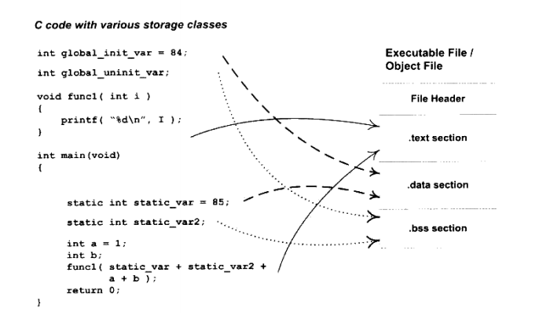
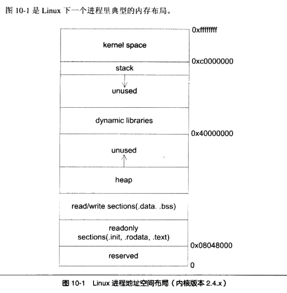

## 第一章 简介

### 1.1 内存

直接操作物理内存存在的问题：

- 不同程序地址空间不隔离
- 内存频繁换入换出使用效率低
- 程序运行地址不确定的问题-重定位的问题

解决办法，不能直接对物理内存进行操作，而是使用一个中间层，虚拟地址virtual address的方法。程序给出的地址是一个虚拟地址，然后通过某种映射，会转换为实际的物理地址，这样达到了地址隔离

采用的实际方法包括：

- 分段segmentation 解决了上面1, 3两个问题，但是分段对内存区域的映射还是按照程序为单位，换入换出都是按照整个程序，颗粒度太大，换入换出很频繁的。
- 分页 page，程序运行有局部性原理，某个时间段内，只用到一小部分程序，于是细颗粒度。分页是把整个程序地址空间分为固定大小的页，如4K。

### 1.2 线程

线程thread，也叫做轻量化进程LightWeightProcess(LWP)，是程序执行流的最小单位。一个线程由线程ID，当前指令指针PC，寄存器合集和堆栈组成。

使用多线程的原因：

- 需要等待的线程，可以进入睡眠状态，例如网络的等待
- 某些操作(计算操作)会消耗大量的时间，如果只有一个线程，和用户的交互就会被打断，多个线程可以一个负责计算，一个负责交互
- 相对于多进程程序，多线程在数据共享方面有优势

#### 1.2.1 线程访问权限

#### 1.2.2 线程的调度

线程由三种状态

- 运行running
- 就绪ready
- 等待 waiting

#### 1.2.3 线程安全

- 竞争和原子操作
- 同步与锁
- 互斥量

## 第二章 静态链接

编译过程分为预处理，编译，汇编，链接的过程

## 第三章 目标文件里面有什么

### 3.1 目标文件的格式

linux平台下的ELF(Executable Linkable Format)文件个格式，包括目标文件.o，动态链接库.so，静态链接库.a

### 3.2 目标文件是什么样的

目标文件里面包括指令代码，数据，还有符号表，调试信息，字符串。按照section的格式存储。

编译后面的机器指令放在**代码段(Code Section)**，代码段有.code和.text。全局变量和局部静态变量数据段放在**数据段(Data Section)**，数据段一般叫.data



程序代码和数据分段的好处：

- 程序被装载后，代码段和数据段被映射到不同的区域，数据段是可读可写的，而代码段只是一个可读的区域。两个区域权限不同，防止代码被有意或者无意修改
- 系统中运行该程序多个副本时候，代码是一样的，不一样的是数据，实现了代码共享

示例代码：

```c
#include <stdio.h>

int prinf(const char* format, ...);

int global_init_var = 84;
int global_unint_var;

void func1(int i)
{
    printf("%d\n", i);
}

int main()
{
    static int static_var = 85;
    static int static_var2;

    int a = 1;
    int b;

    func1(static_var + static_var2 + a + b);

    return a;
}
```

使用命令-c只编译不链接

```c
gcc -c simpleSection.c
objdump -h simpleSection.o
```

```c++
simpleSection.o:     file format elf64-x86-64

Sections:
Idx Name          Size      VMA               LMA               File off  Algn
  0 .text         0000005f  0000000000000000  0000000000000000  00000040  2**0
                  CONTENTS, ALLOC, LOAD, RELOC, READONLY, CODE
  1 .data         00000008  0000000000000000  0000000000000000  000000a0  2**2
                  CONTENTS, ALLOC, LOAD, DATA
  2 .bss          00000004  0000000000000000  0000000000000000  000000a8  2**2
                  ALLOC
  3 .rodata       00000004  0000000000000000  0000000000000000  000000a8  2**0
                  CONTENTS, ALLOC, LOAD, READONLY, DATA
  4 .comment      0000002c  0000000000000000  0000000000000000  000000ac  2**0
                  CONTENTS, READONLY
  5 .note.GNU-stack 00000000  0000000000000000  0000000000000000  000000d8  2**0
                  CONTENTS, READONLY
  6 .note.gnu.property 00000020  0000000000000000  0000000000000000  000000d8  2**3
                  CONTENTS, ALLOC, LOAD, READONLY, DATA
  7 .eh_frame     00000058  0000000000000000  0000000000000000  000000f8  2**3
                  CONTENTS, ALLOC, LOAD, RELOC, READONLY, DATA
```

可以使用objdump工具把目标文件二进制打印出来

```C++
objdump -d -s simpleSection.o
```

```C++
simpleSection.o:     file format elf64-x86-64

Contents of section .text:
 0000 f30f1efa 554889e5 4883ec10 897dfc8b  ....UH..H....}..
 0010 45fc89c6 488d3d00 000000b8 00000000  E...H.=.........
 0020 e8000000 0090c9c3 f30f1efa 554889e5  ............UH..
 0030 4883ec10 c745f801 0000008b 15000000  H....E..........
 0040 008b0500 00000001 c28b45f8 01c28b45  ..........E....E
 0050 fc01d089 c7e80000 00008b45 f8c9c3    ...........E...
Contents of section .data:
 0000 54000000 55000000                    T...U...
Contents of section .rodata:
 0000 25640a00                             %d..
Contents of section .comment:
 0000 00474343 3a202855 62756e74 7520392e  .GCC: (Ubuntu 9.
 0010 342e302d 31756275 6e747531 7e32302e  4.0-1ubuntu1~20.
 0020 30342e31 2920392e 342e3000           04.1) 9.4.0.
Contents of section .note.gnu.property:
 0000 04000000 10000000 05000000 474e5500  ............GNU.
 0010 020000c0 04000000 03000000 00000000  ................
Contents of section .eh_frame:
 0000 14000000 00000000 017a5200 01781001  .........zR..x..
 0010 1b0c0708 90010000 1c000000 1c000000  ................
 0020 00000000 28000000 00450e10 8602430d  ....(....E....C.
 0030 065f0c07 08000000 1c000000 3c000000  ._..........<...
 0040 00000000 37000000 00450e10 8602430d  ....7....E....C.
 0050 066e0c07 08000000                    .n......

Disassembly of section .text:

0000000000000000 <func1>:
   0:   f3 0f 1e fa             endbr64
   4:   55                      push   %rbp
   5:   48 89 e5                mov    %rsp,%rbp
   8:   48 83 ec 10             sub    $0x10,%rsp
   c:   89 7d fc                mov    %edi,-0x4(%rbp)
   f:   8b 45 fc                mov    -0x4(%rbp),%eax
  12:   89 c6                   mov    %eax,%esi
  14:   48 8d 3d 00 00 00 00    lea    0x0(%rip),%rdi        # 1b <func1+0x1b>
  1b:   b8 00 00 00 00          mov    $0x0,%eax
  20:   e8 00 00 00 00          callq  25 <func1+0x25>
  25:   90                      nop
  26:   c9                      leaveq
  27:   c3                      retq

0000000000000028 <main>:
  28:   f3 0f 1e fa             endbr64
  2c:   55                      push   %rbp
  2d:   48 89 e5                mov    %rsp,%rbp
  30:   48 83 ec 10             sub    $0x10,%rsp
  34:   c7 45 f8 01 00 00 00    movl   $0x1,-0x8(%rbp)
  3b:   8b 15 00 00 00 00       mov    0x0(%rip),%edx        # 41 <main+0x19>
  41:   8b 05 00 00 00 00       mov    0x0(%rip),%eax        # 47 <main+0x1f>
  47:   01 c2                   add    %eax,%edx
  49:   8b 45 f8                mov    -0x8(%rbp),%eax
  4c:   01 c2                   add    %eax,%edx
  4e:   8b 45 fc                mov    -0x4(%rbp),%eax
  51:   01 d0                   add    %edx,%eax
  53:   89 c7                   mov    %eax,%edi
  55:   e8 00 00 00 00          callq  5a <main+0x32>
  5a:   8b 45 f8                mov    -0x8(%rbp),%eax
  5d:   c9                      leaveq
  5e:   c3                      retq
```

使用size命令可以看到各个段的大小，可以和上面对应

```C++
joe@DESKTOP-CJN31D4:~/test$ size simpleSection.o
   text    data     bss     dec     hex filename
    219       8       4     231      e7 simpleSection.o
```

.data 段存储的是已经初始化了的全局变量和局部静态变量，上面的代码有两个global_init_var和static_var，共8个字节，符合data段长度。

.rodata存放的是只读数据(const 修饰变量)和字符串常量

.bss段存放的是未初始化的全局变量和局部静态变量，上面的global_unint_var和static_var2就是，更准确的说法是.bss段为他们预留了空间，通过`objdump -h simpleSection.o`看到有4个字节，这个和两个变量8个字节不符合。

#### 3.2.1 自定义段

通常情况下，gcc编译出来的代码，会放在指定的段，如何可以自己指定某个变量或者代码放在指定的段，可以使用gcc提供的__atrribute__。

```C++
_attribute__((section("Foo"))) int global = 42;

joe@DESKTOP-CJN31D4:~/test$ objdump -s simpleSection.o

simpleSection.o:     file format elf64-x86-64

Contents of section .text:
 0000 f30f1efa 554889e5 4883ec10 897dfc8b  ....UH..H....}..
 0010 45fc89c6 488d3d00 000000b8 00000000  E...H.=.........
 0020 e8000000 0090c9c3 f30f1efa 554889e5  ............UH..
 0030 4883ec10 c745f801 0000008b 15000000  H....E..........
 0040 008b0500 00000001 c28b45f8 01c28b45  ..........E....E
 0050 fc01d089 c7e80000 00008b45 f8c9c3    ...........E...
Contents of section .data:
 0000 54000000 55000000                    T...U...
Contents of section .rodata:
 0000 01000000 25640a00                    ....%d..
Contents of section Foo:
 0000 2a000000                             *...
Contents of section .comment:
 0000 00474343 3a202855 62756e74 7520392e  .GCC: (Ubuntu 9.
 0010 342e302d 31756275 6e747531 7e32302e  4.0-1ubuntu1~20.
 0020 30342e31 2920392e 342e3000           04.1) 9.4.0.
Contents of section .note.gnu.property:
 0000 04000000 10000000 05000000 474e5500  ............GNU.
 0010 020000c0 04000000 03000000 00000000  ................
Contents of section .eh_frame:
 0000 14000000 00000000 017a5200 01781001  .........zR..x..
 0010 1b0c0708 90010000 1c000000 1c000000  ................
 0020 00000000 28000000 00450e10 8602430d  ....(....E....C.
 0030 065f0c07 08000000 1c000000 3c000000  ._..........<...
 0040 00000000 37000000 00450e10 8602430d  ....7....E....C.
 0050 066e0c07 08000000                    .n......
```

### 2.3 ELF文件结构

EFL结构包括头文件，段表，字符串表，符号表等

#### 2.3.1 头文件

readelf工具查看头

```C++
joe@DESKTOP-CJN31D4:~/test$ readelf -h simpleSection.o
ELF Header:
  Magic:   7f 45 4c 46 02 01 01 00 00 00 00 00 00 00 00 00
  Class:                             ELF64
  Data:                              2's complement, little endian
  Version:                           1 (current)
  OS/ABI:                            UNIX - System V
  ABI Version:                       0
  Type:                              REL (Relocatable file)
  Machine:                           Advanced Micro Devices X86-64
  Version:                           0x1
  Entry point address:               0x0
  Start of program headers:          0 (bytes into file)
  Start of section headers:          1272 (bytes into file)
  Flags:                             0x0
  Size of this header:               64 (bytes)
  Size of program headers:           0 (bytes)
  Number of program headers:         0
  Size of section headers:           64 (bytes)
  Number of section headers:         15
  Section header string table index: 14
```

#### 2.3.2 段表

段表是ELF文件除了头文件外最重要的结构，它描述了ELF的各个段的信息，比如每个段的段名、长度、在文件中的偏移、读写权限。

objdump -h 可以看到simpleSection.o总共有6个段，其实只是把关键的段列出来了，还有其它辅助性的段。比如符号表、字符串表、重定位表等，需要使用readelf工具来查看

```C++
joe@DESKTOP-CJN31D4:~/test$ readelf -S simpleSection.o
There are 15 section headers, starting at offset 0x4f8:

Section Headers:
  [Nr] Name              Type             Address           Offset
       Size              EntSize          Flags  Link  Info  Align
  [ 0]                   NULL             0000000000000000  00000000
       0000000000000000  0000000000000000           0     0     0
  [ 1] .text             PROGBITS         0000000000000000  00000040
       000000000000005f  0000000000000000  AX       0     0     1
  [ 2] .rela.text        RELA             0000000000000000  000003d8
       0000000000000078  0000000000000018   I      12     1     8
  [ 3] .data             PROGBITS         0000000000000000  000000a0
       0000000000000008  0000000000000000  WA       0     0     4
  [ 4] .bss              NOBITS           0000000000000000  000000a8
       0000000000000004  0000000000000000  WA       0     0     4
  [ 5] .rodata           PROGBITS         0000000000000000  000000a8
       0000000000000008  0000000000000000   A       0     0     4
  [ 6] Foo               PROGBITS         0000000000000000  000000b0
       0000000000000004  0000000000000000  WA       0     0     4
  [ 7] .comment          PROGBITS         0000000000000000  000000b4
       000000000000002c  0000000000000001  MS       0     0     1
  [ 8] .note.GNU-stack   PROGBITS         0000000000000000  000000e0
       0000000000000000  0000000000000000           0     0     1
  [ 9] .note.gnu.propert NOTE             0000000000000000  000000e0
       0000000000000020  0000000000000000   A       0     0     8
  [10] .eh_frame         PROGBITS         0000000000000000  00000100
       0000000000000058  0000000000000000   A       0     0     8
  [11] .rela.eh_frame    RELA             0000000000000000  00000450
       0000000000000030  0000000000000018   I      12    10     8
  [12] .symtab           SYMTAB           0000000000000000  00000158
       00000000000001f8  0000000000000018          13    13     8
  [13] .strtab           STRTAB           0000000000000000  00000350
       0000000000000084  0000000000000000           0     0     1
  [14] .shstrtab         STRTAB           0000000000000000  00000480
       0000000000000078  0000000000000000           0     0     1
Key to Flags:
  W (write), A (alloc), X (execute), M (merge), S (strings), I (info),
  L (link order), O (extra OS processing required), G (group), T (TLS),
  C (compressed), x (unknown), o (OS specific), E (exclude),
  l (large), p (processor specific)
```

#### 2.3.3 重定位表

上面段表可以看到有一个.rel.txt，重定位表(Relocation Table)，链接器在处理目标文件的时候，必须对目标文件中的某些部位进行重新定位，即代表段和数据段中那些绝对地址的应用的位置。这些重定位的信息都记录在ELF文件的重定位表中，对于每个需要重新定位的代码段和数据段，都会有一个重新定位表。

.rel.txt就是对.txt段的重定位表，上面代码中使用了库函数printf，而.data段没有使用外部的变量，所以没有

#### 2.3.4 字符串表

EFL文件中用到了很多字符串，字符串长度不确定，用一个固定的数据结构来表示比较困难，就把字符串集中放到一个表中，然后用字符串在整个表中的偏移量来引用字符串

### 3.4 链接的接口-符号

链接的本质就是把不同的目标文件相互拼接在一起，它们的拼接是目标文件之间地址的引用，即对函数和变量地址的引用。这里有一个定义define和引用reference的概念。在链接中，函数和变量都是符号symbol

每一个目标文件中都有一个相应的符号表symbol table，表里面记录了所有的符号symbol和它的值，symbol value，也就是地址。

```C++
joe@DESKTOP-CJN31D4:~/test$ nm simpleSection.o
                 U _GLOBAL_OFFSET_TABLE_
0000000000000000 R a
                 U c
0000000000000000 T func1
0000000000000000 D global
0000000000000000 D global_init_var
0000000000000004 C global_unint_var-
0000000000000028 T main
                 U printf
0000000000000004 d static_var.2325
0000000000000000 b static_var2.2326
```

### 3.5 ELF符号表结构

### 3.6 特殊符号

### 3.7 符号修饰和函数签名

为了防止符号冲突，所有C代码的变量和函数经过编译后，符号名下面都要加上下划线`_`，一个`foo`函数，经过编译后`_foo`函数

#### 3.7.1 C++符号修饰

### 3.8 exterm "C"

C++为了和C兼容，在符号管理上，有一个C++用来声明和定义C语言的extern C关键字用法  

### 3.9 调试信息

目标文件里还保存着调试信息，现在编译器都支持源代码级别的调试。gcc编译时加上 -g 参数，编译器会在目标文件中加上调试信息，我们通过readelf等工具看到，文件里面有很多debug信息

## 第四章 静态链接

### 4.1 空间和地址分配

链接器为目标文件分配地址和空间，这里的地址和空间有两个含义，第一个是输出的可执行文件中的空间，第二个是装载后的虚拟地址中的虚拟地址空间。对于有实际数据的段，.txt和.data段，他们在文件和虚拟地址空间都要分配空间，对于.bss段，分配的空间只在虚拟地址空间，因为它在文件中没有内容。

我们这里谈到的空间的分配，只关注虚拟地址空间的分配，因为这个关系到链接器后面关于地址计算的步骤，而可执行文件本身的空间分配与链接过程关系并不大。

链接器空间分配，一般都是把各个段合并在一起，采用的方法叫做两步链接：

- **地址和空间的分配** 扫描所有的目标文件，获得他们的段的长度，属性和位置，将所有的符号定义和符号引用收集起来，统一放到一个全局符号表。
- **符号解析与重定位** 这一步是关键，特别是重定位的过程

#### 4.2 符号解析与重定位

##### 4.2.1 重定位表

重定位表(Relocation Table)用来存储与重定位相关的信息

### 4.4 C++相关问题

C++ 有两个方面需要特别注意，一个是重复代码消除，一个是全局构造和析构

#### 4.4.1 重复代码消除

C++编译器在很多时候会产生重复的代码，比如模板，虚表函数，外部内联函数，都可以能在不同的编译单元生成相同的代码。比如模板，模板在本质上很像宏，当模板在一个模块被实例化后，并不知道有没有在其他的单元被实例化，所以很可能生成了很多重复的代码

一个有效的办法是每个模板的实例代码都单独放在一个段子里，每一个段只包含一个模板实例。比如有一个模板函数是add<T>()，某个编译单元以int和float类型实例化了该函数模板，这个编译单元的目标文件中就包含了这两个模板实例的段。

这种方法也是有问题的，相同名称的段可能拥有不同的内容，可能是由于不同的编译单元使用了不同的编译器版本或者编译优化选项

**函数级别链接**

由于现在程序和库都很大，一个目标文件中有很多函数或者变量，链接整个目标文件，没有用到的函数也被链接进来了。

于是有了一个函数级别链接(Functional-Level Linking)，这个选项的作用就是让所有的函数和前面的模板函数一样，单独保存在一个段里面，当链接器用到的时候，就把它合并到输出文件中，没用到的函数就丢弃掉。

GCC编译器也提供了类似的机制，`-ffunction-sections`和`-fdata-sections`，这两个选项的作用就是把每个函数或者变量放在独立的段中

#### 4.4.2 全局构造与解析

我们知道一个一般的C/C++程序从main函数开始执行，随着main函数的结束而结束。然后，在main函数被调用之前，为了程序能够顺利执行，要先初始化进程执行环境，不如堆分配初始化(malloc、free)、程序子系统等。C++全局对象的构造函数在main之前执行。

Linux系统下一般程序的入口是`_start`，这个函数是`Linux`库`Glibc`的一部分，我们的程序和Glic库链接在一起最后形成了可执行文件，这个函数就是程序的初始化部分的入口。

EFL文件定义了两个特殊的段：

- .ini 该段保存的是可执行指令，构成了进程的初始化代码
- .fini 该段保存着进程终止代码指令

## 第五章 Windows PE/COFF

暂时跳过

## 第六章 装载和动态链接

装载就是可执行文件，加载到内存的过程，本文主要介绍ELF文件在Linux下的装载过程

### 6.1 进程虚拟地址空间

### 6.2 装载的方式

程序在运行时候有局部性原理，所以我们可以将程序最常用的部分驻留在内存中，而将一些不太常用的数据存放在磁盘中，这个就是动态装入的基本原理。

覆盖装入(Overlay)和页映射(Paging)是两种很典型的动态装载方法，思想差不多，就是程序用到那个模块，就把那个模块装入到内存，覆盖装入现在被淘汰了。

### 6.3 从操作系统角度看可执行文件的装载

如果直接使用物理地址进行操作，那么每次页被装入时都需要定位，现代的硬件MMU都提供地址转换的功能。

#### 6.3.1 进程的建立

- 首先建立虚拟地址空间
- 读取可执行文件头、并且建立虚拟空间与可执行文件的映射关系
- CPU指令寄存器设置为可执行文件入口、启动运行

#### 6.3.2 页错误

#### 6.3.3 进程虚存空间分配

当段的数量增加时候，例如不止有代码段，还有数据段，等等。EFL文件映射是按照系统的页长为单位的，每个段在映射的长度都是页长度的整数倍。一个ELF文件往往有十几个段，内存空间会造成浪费，如何解决。

操作系统装载可执行文件的角度看，实际上它并不关心可执行文件各个段的具体内容，操作系统只关心一些装载有关的问题，主要就是段的权限(可读、可写、可执行)，ELF文件中，段的权限组合只有几种，基本上是三种：

- 以代码段为代表的权限为可读可执行的段
- 以数据段和BSS段为代表的可读可写的权限
- 只读数据段为代表的权限是只读的段

于是，我们把相同权限的段，合并在一起，当成一个段来映射

#### 6.3.4 堆和栈

操作系统通过给进程空间划分一个个VMA来管理进程的虚拟空间，基本原则是将相同权限属性的、有相同映像文件的映射成一个VMA，一个进程基本上可以分为如下几种VMA区域：

- 代码VMA，只读、可执行；有映像文件
- 数据VMA，可读可写；有映像文件
- 堆VMA，权限可读可写，可执行；无映像文件，向上扩展
- 栈VMA，权限可读不可以执行，无映像文件，向下扩展

#### 6.3.5 堆的最大申请数量

Linux下虚拟地址空间分给进程本身的是3GB，那么真正可以用到的有多少呢，程序中一般用malloc来进行地址空间的申请，可以用malloc来测试一下：

```C++
#include <stdio.h>
#include <stdlib.h>

unsigned maximum = 0;

int main()
{
    unsigned blocksize[] = {1024 * 1024, 1024, 1};
    int i, count;
    for (i = 0; i < 3; i++) {
        for (count = 1; ;count++) {
            void *block = malloc(maximum + blocksize[i] * count);
            if (block) {
                maximum = maximum + blocksize[i] * count;
                printf("i = %d, count = %d, maximum malloc size = %u bytes\n", i, count, maximum);
                free(block);
            } else {
                break;
            }
        }
    }
    printf("finally maximum malloc size = %u bytes\n", maximum);
}
```

#### 6.3.6 进程栈初始化

### 6.4 Linux内核装载ELF过程简介

linux系统bash下面输入一个命令执行某个ELF程序时，linux系统如何装载这个ELF文件并且执行的。

首先在用户层面，bash进程会调用fork()系统调用创建一个新的进程，然后新的进程调用execve()执行指定的ELF文件原来的bash进程继续返回等待刚才启动的新进程结束，然后继续等待用户输入命令

## 第七章 动态链接

静态链接存在的问题包括：

- 公共库被重复链接，加载到内存里面去了，造成内存严重浪费
- 静态链接对程序更新、部署和发布带来了很多麻烦，包中的一个库更新了，就得升级整个包

动态链接可以解决上面的两个问题，但是动态链接也存在问题，模块更新导致接口不兼容

### 7.1 地址无关代码

## 第八章 库与运行库

### 8.1 共享库版本

共享库的开发者不停更新共享库的版本，以修改原有的bug，增加新的功能或者改进功能。很容易导致接口不兼容了

共享库的兼容性问题，其中一个有效的方法是：共享库版本，它规定共享库的文件命名规则必须如下：

libname.so.x.y.z

x表示主版本号(major version number) y表示次版本号(minor version number) z表示发布版本号(release version number)

**主版本号**代表库的重大更新，不同主版本号的库之间是不兼容的

**次版本号**表示库的增量更新，增加一些新的接口符号，且保持原来的符号不变，在主版本号不变的情况下，高的次版本号向后兼容低的次版本号的库

**发布版本号**表示库的一些错误的修正、性能的改进等等，不添加任何新的接口，也不对接口进行更改。

### 8.2 SO-NAME

linux采用so-name的机制来记录共享库的依赖关系，每一个共享库都有一个对应的so-name，这个so-name就是共享库的文件名去掉次版本号和发布版本号，保留主版本。

libfoo.so.2.6.1的so-name叫做libfoo.so.2。

so-name相同的两个共享库，次版本号大的兼容版本号小的，linux系统中，系统为每一个共享库在他的目录创建一个跟so-name相同并且指向它的软链接(symbol link)。

```C++
lrwxrwxrwx 1 root root   16 Apr  6  2020 libdmmp.so -> libdmmp.so.0.2.0
-rw-r--r-- 1 root root  35K Apr  6  2020 libdmmp.so.0.2.0
lrwxrwxrwx 1 root root   18 Mar  4  2020 libhandle.so.1 -> libhandle.so.1.0.3
-rw-r--r-- 1 root root  15K Mar  4  2020 libhandle.so.1.0.3
```

建立软链接的作用是，这个软链接会指向目录中主版本号相同，次版本号和发布版本号都最新的共享库，建立这个软链接的目的，使得所有依赖某个共享库的模块，在编译、链接和运行时候，都使用共享库的so-name，而不是更加详细的版本号。

当共享库进行升级时候，如果只是进行增量升级，即保持主版本号不变，只升级次版本号或者发布版本号，我们就可以用新的共享库替换到旧版，并且修改软链接指向新版本库，就可以升级；共享库的主版本号升级时，系统中存在多个so-name，由于这些so-name不相同，所以程序不受影响。

### 8.3 共享库系统路径

linux操作系统都遵守一个FHS的标准，规定了一个系统中，系统文件都应该如何存放，包括各个目录的结构、组织和作用，这有利于促进各个开源操作系统之间的兼容性。FHS规定，一个操作系统中主要有两个存放共享库的位置，它们分别如下：

- /lib，这个位置主要存放系统最关键和基础的共享库，比如动态链接器、C语言运行库、数学库。
- /usr/lib，这些目录下主要保存的是一些非系统运行时所需要的关键性的共享库，主要是一些开发时用到的共享库。
- /usr/local/lib，这个目录用来放一些和操作系统本身十分不想关的库，主要是一些第三方的应用程序的库。比如我们在系统中安装了python语言的解释器，那么相关库就会放在/usr/local/lib/python，而它的可执行文件可能放在/usr/local/bin下。

### 8.4 共享库查找过程

开源系统中，包括所有的Linux系统在内的很多都是基于Glibc的，我们知道在这些系统里面，动态链接的ELF可执行文件在启动时同时会启动动态链接器，在Linux中，动态链接器是/lib/ld-linux.so.X，**程序所依赖的共享对象全部由动态链接器负责装载和初始化**

### 8.5 环境变量

- LD_LIBRARY_PATH 修改某个应用程序的共享库查找路径

```C++
$ LD_LIBRARY_PATH=/home/usr /bin/ls	
```

动态链接器查找共享库的顺序

1. 环境变量LD_LIBRARY_PATH指定的路径

2. 由路径缓存文件/etc/ld.so.cache指定的路径

3. 默认共享路径，先/usr/lib，后/lib

- LD_PRELOAD 预先装载一些共享库或者目标文件，指定的文件会在动态链接器按照固定规则搜索共享库之前装载，比LD_LIBRARY_PATH还要优先，无论程序是否要依赖它们，都会被装载

  由于全局符号介入的这个机制，LD_PRELOAD里面指定的共享库或者目标文件中的全局符号会覆盖后面加载的同名全局符号

- LD_DEBUG

  这个变量可以打开动态链接器的调试功能，当我们设置这个变量的时候，动态链接器会在运行时打印出各种有用的信息

### 8.6 清除符号信息

正常编译出来的共享库或者可执行文件，含有符号信息和调试信息

```C++
strip	
```

### 8.7 共享库的安装


## 第十章 内存

### 10.1 程序的内存分布


### 10.2 栈和调用惯例

栈保存了一个函数调用所需要维护的信息，常常被称为堆栈帧(stack frame)或者活动记录，stack frame一般包括如下几个方面的内容：

- 函数的返回地址和参数
- 临时变量：函数的非静态局部变量
- 保存的上下文：包括在函数调用前后需要保持不变的寄存器

### 10.3 堆和内存惯例


